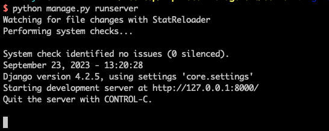
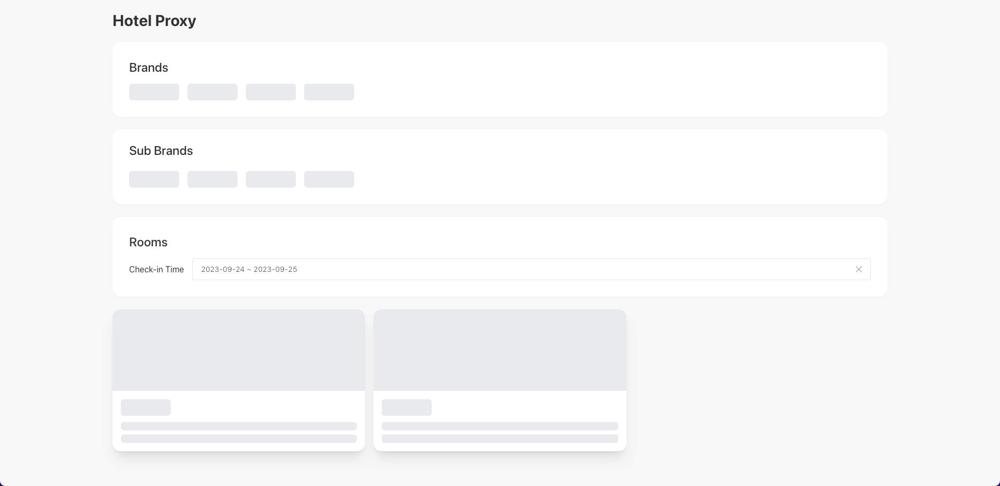
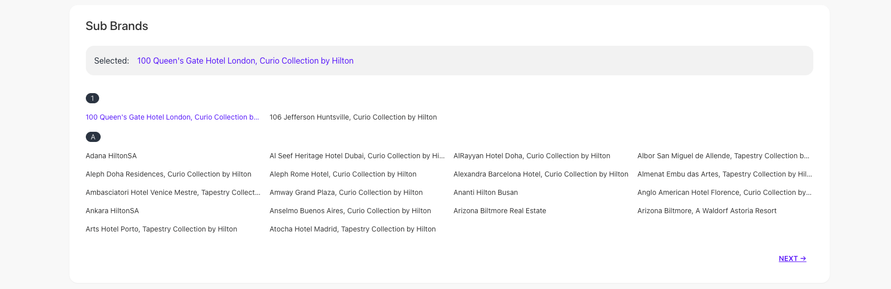
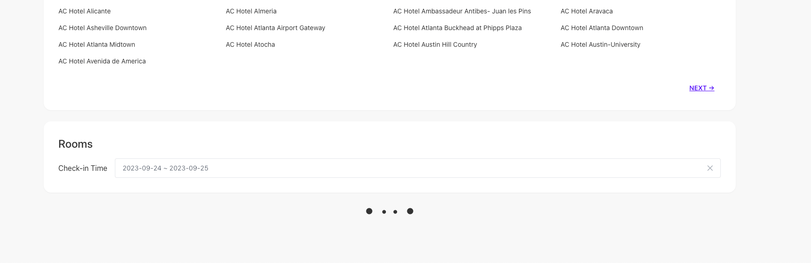
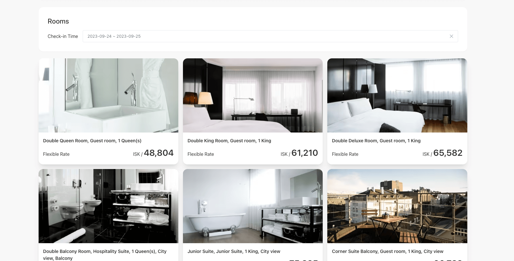
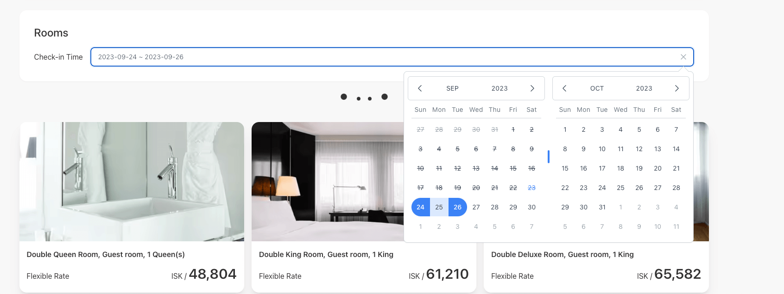
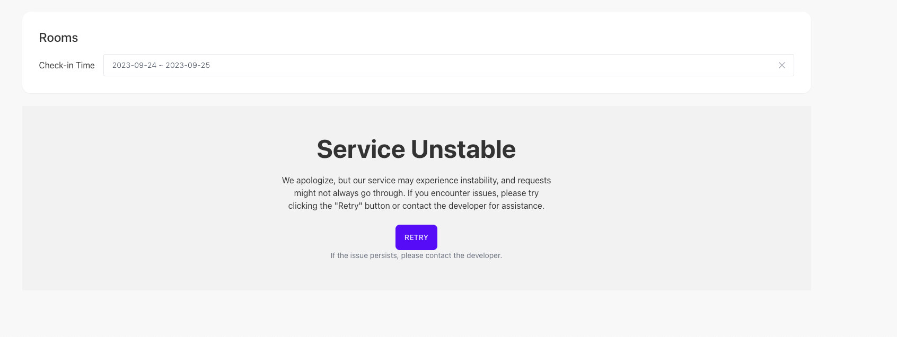
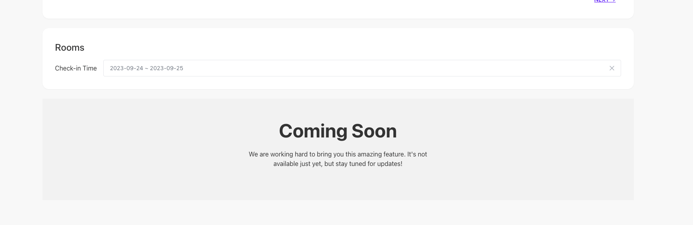

# MVP Hotel Proxy Project

该项目是用 Django + React 实现的全栈项目，实现了解析在线酒店网页存储数据库再展示到对应的前端的功能，称之为 Hotel 代理。

- 后端 Django

  1.  开发环境 Python 3.10.9
  2.  中间库的使用

      - `djangorestframework` 搭建 rest api
      - `playwright` 爬取网页
      - `beautifulsoup4` 网页解析
      - `sqlite` 数据库

  3.  开发运行命令（`cd server`）

      - `python -m venv env` 创建 python 环境
      - ` source env/bin/activate` 激活 python 环境
      - `pip install -r requirements.txt` 安装依赖
      - `python manage.py makemigrations`
      - `python manage.py makemigrations api`
      - `python manage.py migrate` 会初始化数据库
      - `python manage.py runserver` 运行服务

  4.  运行成功

      - 请访问 http://127.0.0.1:8000/
        

  5.  接口配置

      - `/api/hotel-managements`

        获取酒店品牌列表

      - `/api/hotels`

        获取酒店品牌对应子酒店

        - 搜索条件 management
        - 分页返回 page

      - `/api/hotel-rooms`

        获取酒店对应日期内出售房间列表

        - 搜索条件 from_date & to_date
        - 搜索对应酒店 management & hotel_code

- 前端 React + TS + Vite

  1.  开发环境 Nodejs v18.18.0

  2.  中间库的使用

      - `tailwindcss + daisyui` 提供组件样式支持
      - `@tanstack/react-query + axios` 提供网络请求状态管理支持

  3.  开发运行命令（`cd web`）

      - `npm install` 安装依赖
      - `npm run dev` 进入开发模式

  4.  项目构成

      - `/api/` 提供 query hook
      - `/components/` 提供公用组件
      - `/context/` 提供需要共享 State
      - `App.tsx` 组合 component 呈现业务逻辑

  5.  运行成功

      - 请访问 http://127.0.0.1:8000/
        

- Preview (其实移动端也做了适配)

  1.  网页对应组件都有各自对应的加载动效果
      

  2.  酒店品牌点击切换
      

  3.  子酒店列表加载，支持分页，支持点击切换，支持首字母展示
      

  4.  酒店房间列表加载效果
      

  5.  酒店房间列表加载成功
      

  6.  酒店房间列表支持入住时间可选一段/一天
      

  7.  酒店房间列表加载失败
      

  8.  部分酒店品牌不支持的展示效果
      

- 不足的地方

  1.  可以看到有四个品牌，当目前只处理 `Marriott`

  2.  sub brands 虽然可以动态分页加载数据，但是需要具体找到一个太不方便了，应该可以考虑新增一个搜索，或者按照首字母快速跳转页数

  3.  解析酒店网页获取数据部分利用了无头浏览器，过程太久了，这个需要找到更好的解决方式

  4.  目前解析完的数据只是存在数据库并未运用起来，也没有做 Cache 处理，目前每次请求都会实时解析网页，这也是导致请求缓慢的原因

# 免责声明

该项目仅供学习和技术交流之用。项目中的内容和代码仅代表作者个人观点和理解，并不代表任何组织或机构的立场。如果您在本项目中发现任何侵犯您的知识产权或其他权益的内容，请联系我们，我们将尽快删除相关内容。

This project is for educational and technical discussion purposes only. The content and code in this project represent the personal views and understanding of the author and do not represent the position of any organization or institution. If you find any content in this project that infringes upon your intellectual property or other rights, please contact us, and we will promptly remove the relevant content.

我们感谢您对知识共享和技术交流的支持与理解。

We appreciate your support and understanding of knowledge sharing and technical exchange.

联系方式：[949734824@qq.com]

Contact: [949734824@qq.com]
